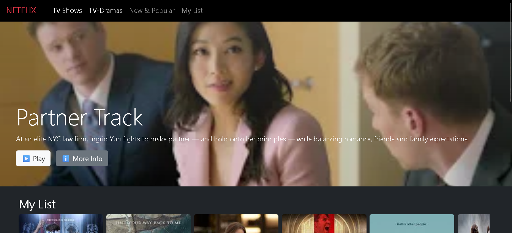

# 🎬 Netflix Clone

Un clone simple de l'interface Netflix, réalisé avec **HTML**, **CSS**, **Bootstrap** et **JavaScript**.  
Ce projet a été conçu à des fins d'apprentissage et de démonstration.

---

## 📸 Aperçu

 <!-- Remplace ce chemin par une image de ton projet -->

---

## 🚀 Fonctionnalités

- Barre de navigation style Netflix
- Section "Hero" avec image et description
- Sections défilantes (carrousels) pour :
  - ✅ *My List*
  - ✅ *TV Dramas*
- Boutons gauche/droite pour faire défiler les contenus
- Défilement fluide et désactivation automatique des flèches si nécessaire

---

## 🛠️ Technologies utilisées

- HTML5
- CSS3
- [Bootstrap 5.3](https://getbootstrap.com/)
- JavaScript (DOM + Scroll)

